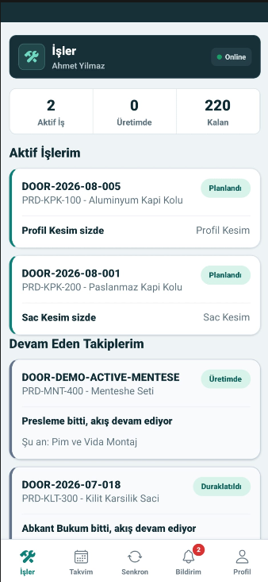
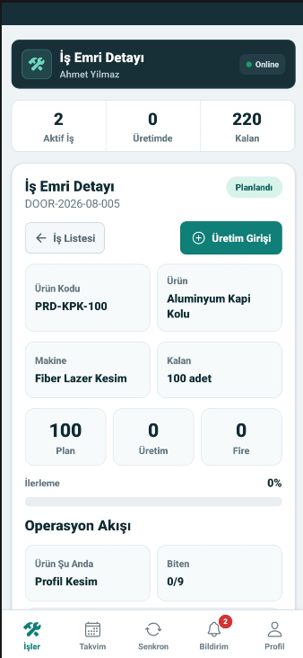
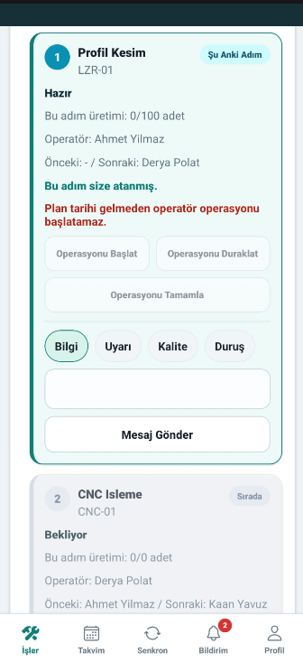
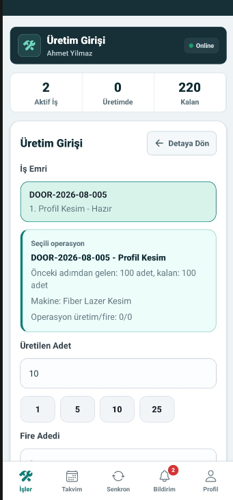
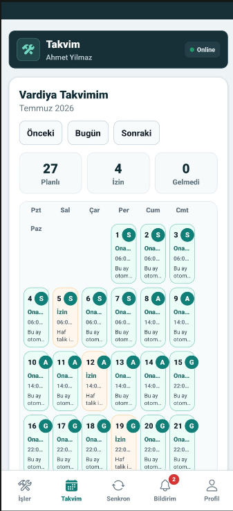
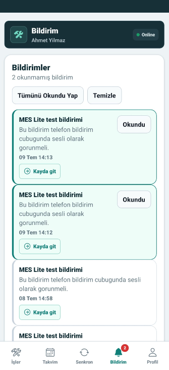
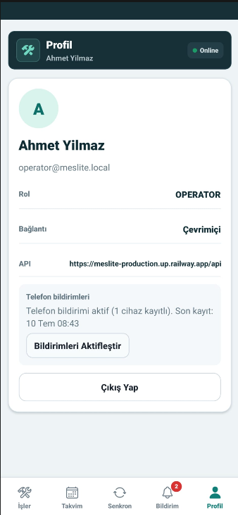

# MES Lite Project Showcase

## Short Pitch

MES Lite is a full-stack Manufacturing Execution System built for route-based factory production tracking. It follows a work order from planning through operator execution, scrap and downtime recording, quality decisions, inventory impact, notifications, and management reporting.

The system includes a React web dashboard, an Expo React Native mobile application, and a Node.js/Express backend with PostgreSQL and Prisma. It is designed around real production constraints: operator authorization, operation handoff, quantity transfer validation, offline-first mobile data capture, duplicate-safe synchronization, and persistent notifications.

## Demo Links

| Service | URL |
| --- | --- |
| Web dashboard | https://mes-lite-web.vercel.app |
| Backend health | https://meslite-production.up.railway.app/health |
| Swagger API documentation | https://meslite-production.up.railway.app/api/docs |
| Android preview APK | https://expo.dev/artifacts/eas/Yrf3o1f7R1272zbckeLHTO8WJHdQXwzSjxiHWxPXDg0.apk |
| GitHub Release | https://github.com/EvindarUcdere/MESLite/releases/tag/v0.1.0 |

## Screenshot Plan

Add screenshots under `docs/screenshots/` using the following filenames. This keeps README, release notes, and portfolio material easy to maintain.

## Mobile Screenshots

<table>
  <tr>
    <td align="center"><br><strong>Active Work</strong></td>
    <td align="center"><br><strong>Work Order Detail</strong></td>
    <td align="center"><br><strong>Operation Actions</strong></td>
    <td align="center"><br><strong>Production Entry</strong></td>
  </tr>
  <tr>
    <td align="center"><br><strong>Evidence And Notes</strong></td>
    <td align="center"><br><strong>Shift Calendar</strong></td>
    <td align="center"><br><strong>Notifications</strong></td>
    <td align="center"><br><strong>Profile And Push</strong></td>
  </tr>
</table>

### Mobile

| File | Screen |
| --- | --- |
| `docs/screenshots/mobile-01-active-work.png` | Active operator work list |
| `docs/screenshots/mobile-02-work-order-detail.png` | Work order detail and operation flow |
| `docs/screenshots/mobile-03-operation-actions.png` | Operation action panel |
| `docs/screenshots/mobile-04-production-entry.png` | Production entry form |
| `docs/screenshots/mobile-05-production-evidence.png` | Production note, critical flag, and visual evidence |
| `docs/screenshots/mobile-06-shift-calendar.png` | Operator shift calendar |
| `docs/screenshots/mobile-07-notifications.png` | Mobile notifications |
| `docs/screenshots/mobile-08-profile-push.png` | Profile and push notification status |

### Web

| File | Screen |
| --- | --- |
| `docs/screenshots/web-01-manager-dashboard.png` | Manager factory performance dashboard |
| `docs/screenshots/web-02-production-panel.png` | Production panel and work order tracking |
| `docs/screenshots/web-03-quality-workflow.png` | Quality queue and decisions |
| `docs/screenshots/web-04-inventory-scrap.png` | Inventory, scrap quarantine, and rework/reproduction tracking |
| `docs/screenshots/web-05-reports-oee.png` | Reports and OEE/root-cause analysis |
| `docs/screenshots/web-06-system-admin.png` | System admin dashboard and user management |

## Suggested Demo Flow

1. Sign in to the web dashboard as a production manager.
2. Review factory performance, active work orders, inventory, notifications, and reports.
3. Open a route-based work order and inspect operation assignments.
4. Sign in to the Android app as an operator.
5. Start an operation, enter production, scrap, downtime, or a field note.
6. Complete the operation and verify the next operation handoff.
7. Record a quality decision and inspect the resulting scrap, rework, or reproduction flow.
8. Turn off connectivity on the phone, create mobile records, then reconnect and verify synchronization.
9. Trigger a notification and verify both in-app and Android notification-bar delivery.

## Technical Highlights

- React web dashboard with role-specific manager, production, quality, and admin workflows.
- Expo React Native mobile app for shop-floor operators and quality staff.
- Offline-first SQLite queue for production, scrap, downtime, quality, and note actions.
- UUID idempotency via backend `OfflineOperationLog` to prevent duplicate replay.
- Socket.io realtime updates for online user experience.
- Persistent notification records and Android push notification support.
- PostgreSQL/Prisma domain model for products, routes, machines, operators, shifts, work orders, inventory, quality, and reporting.
- SQL-based KPI and factory performance reporting.
- Railway backend deployment, Vercel web deployment, and Expo EAS Android build.

## Security And Deployment Notes

- Runtime secrets must stay in environment variables, not in Git.
- `mobile/google-services.json` is ignored locally and should not be committed.
- Android push builds use Firebase/FCM configuration during EAS build.
- Firebase service account private keys, Railway variables, Expo tokens, database URLs, and `.env` files must never be committed.

## Release Notes Template

Title:

```text
MES Lite v0.1.0 - Portfolio Demo
```

Description:

```text
Initial public portfolio demo for MES Lite.

Includes:
- React web dashboard for production, quality, inventory, reporting, and administration workflows
- Node.js/Express API with PostgreSQL and Prisma
- Expo React Native Android app for operator and quality workflows
- Offline-first mobile queue with duplicate-safe synchronization
- Route-based operation handoff and production integrity rules
- Quality, scrap, rework, reproduction, and notification workflows
- Android push notification support

Live web demo:
https://mes-lite-web.vercel.app

Backend health:
https://meslite-production.up.railway.app/health

Swagger API docs:
https://meslite-production.up.railway.app/api/docs

Android APK:
https://expo.dev/artifacts/eas/Yrf3o1f7R1272zbckeLHTO8WJHdQXwzSjxiHWxPXDg0.apk
```
